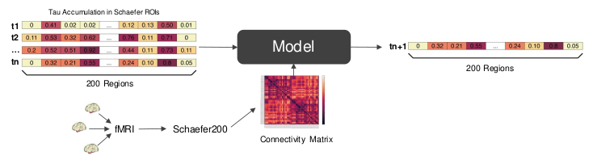

# Connectome Informed Attention — Predicting Tau Spreading for Alzheimer's Disease



## Overview

This repository is structured as follows:

- `code`: The main code to train and evaluate the models.
- `notebooks`: Exploratory and auxiliary Jupyter notebooks.
- `presentations`: The presentations, as well as the final poster.

The required data can be obtained from the [ADNI Project](http://adni.loni.usc.edu/).

## How to install dependencies

To install them, run:

```
pip install -r requirements.txt
```

## How to train the model

-- description 

```
python train.py
```

## How to test the model

-- description
```
python test.py
```

## Authors 
Project implemented and maintained by Andres Zapata Rodriguez, Mohamed Said Derbel, Niklas Bühler.
